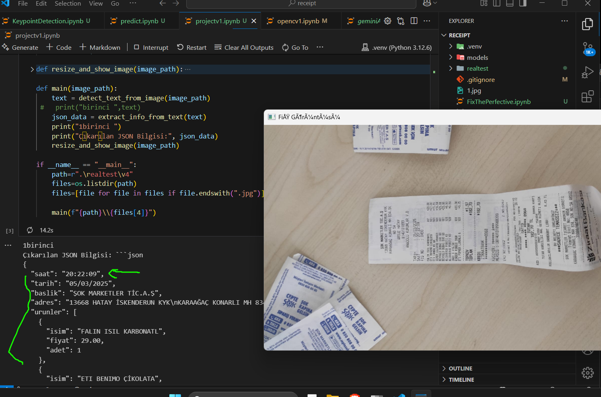
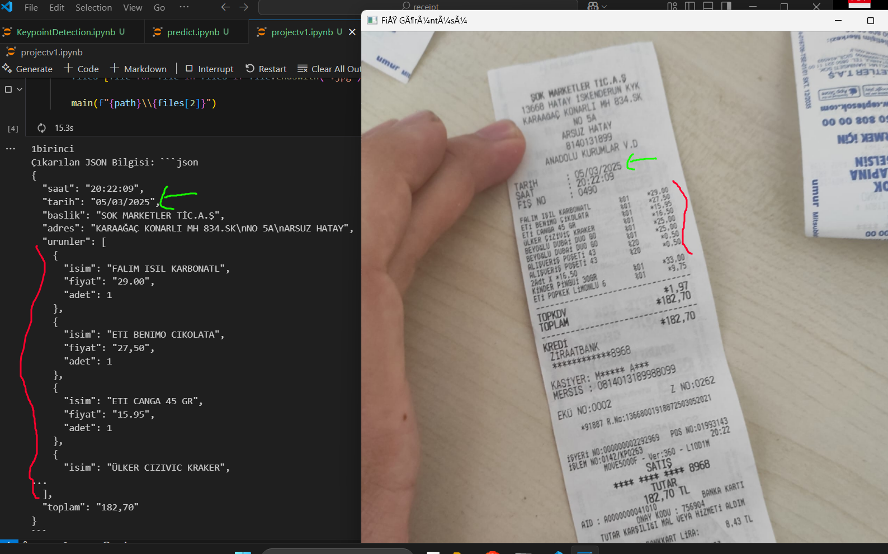

"# ReadReceiptWithAI" 
you can find the  all models with this link:https://drive.google.com/drive/folders/1pCY8kawFgbk2JFd_qE7PK6mxA-twoCw1?usp=sharing

in here I used the gemini and google ocr api 
and
  I used yolo model for detect/segment area and blur the box without other area then send the gemini
 
I marked the same area 

